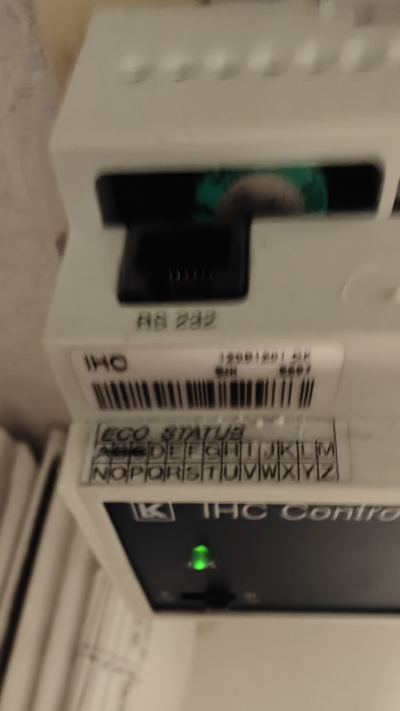
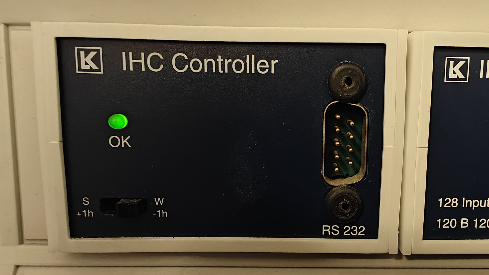
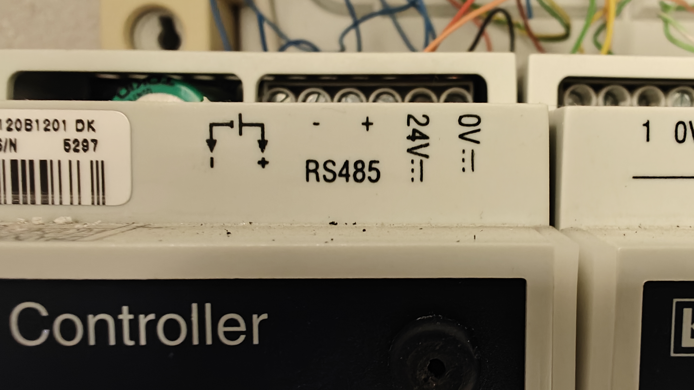

# General information

This IHC tool is made to control older IHC systems using a Raspberry Pi.
It allows you to interface with the IHC bus and control various IHC devices.

It communicates with IHC controller via the RS-485 bus using a USB to RS-485 adapter.

I use a Raspberry Pi Zero 2W with Raspberry Pi OS Lite (64-bit) installed to run the tool.


I'm using this adapter: [Amazon.de - RS-485 adapter](https://www.amazon.de/dp/B0FX2PTXQ7?ref=ppx_yo2ov_dt_b_fed_asin_title)\
`USB to RS485/RS422 Converter Adapter with FT232RNL Chip Triple Protection Multi OS Compatible`
### IMPORTANT: This tool is only tested on an old IHC system.\
It is the first version of the IHC system, the one without an ethernet RJ-45 interface, but only RS-232 on the front and RS-485 terminals on top.\
My controller states that is is version 6.03 DK




---
# Building and installing
The code is written in C# and requires .NET 10 or later to build and run.

The project consists of multiple parts:
- **`IHC_Controller_Service:`**\
This handles the communication with the IHC bus and exposes a SignalR hub to control the IHC devices.
- **`ESPHome_Server:`** \
This is a service that allows you to control the IHC system via the ESPHome integration in Home Assistant.
- **`IHC_WebApi:`**\
This is a web interface to control and monitor the IHC system.
- **`IHC_Client:`**\
This is a simple command line client that can connect to the Ser2Net service and control the RS-232 interface.\
This has the same functionality as the original IHC PC software.\
I use this adapter: [RS-232 adapter for Raspberry Pi](https://www.conradelektronik.dk/da/p/rs232-udvidelses-kort-til-raspberry-pi-1337093.html?refresh=true)
- **`IHC_MAUI_App:`**\
This is a small test application for Windows, Android and iOS to control the IHC system via the Web API.
- **`IHC_MAUI_Web:`**\
This is a small test web application to control the IHC system via the Web API.

I only use the IHC_Controller_Service and ESPHome_Server on the Raspberry Pi. That is all you need to make it work in Home Assistant using the ESPHome integration.

---
### Copy to Linux
Once the code has been build you must export it to a linux compatible format. This can be done with Visual Studio or via the command line:

**```Dotnet publish -c Release -r linux-arm64 --self-contained```**\
I build the projects as self-contained, so that I don't have to manually install .net on the Raspberry Pi.

You can then copy the output files to your Raspberry Pi in your Home directory under two sub directories like "ESPHome" and "IHC_Controller".

---
### Ser2Net
By default the services communicate with the IHC system via the Ser2Net service.\
This means you must install and configure Ser2Net on your Raspberry Pi to use the USB to RS-485 adapter.\
In the IHC_Controller_Service folder you will find a file named "ser2net.yaml" that you can use as a template to configure Ser2Net.\
Edit the configuration for Ser2Net and paste the content of the file in. Use the command:\
```sudo nano /etc/ser2net.yaml```

Restart Ser2Net with:\
```sudo systemctl restart ser2net```

Use this command to check that Ser2Net is running:\
```sudo systemctl status ser2net```

#### Why do I use Ser2Net?
Ser2Net is a simple service that exposes serial ports via TCP/IP. This means that the IHC_Controller_Service can connect to the IHC bus via TCP/IP instead of directly to the serial port.\
Now I can run the IHC_Controller_Service in a container or on another machine if needed. Makes it easier to debug and test.

---
### Install the services
On the Raspberry Pi you can create systemd service files to run the services in the background. I have added two files
"esphome_server.service" and "ihc_controller_service.service" that you can use as a template.\

Just copy them to "/etc/systemd/system/" and point them to the correct executable paths.\

After copying the service files you can start them with:\
```sudo systemctl start ihc_controller```\
```sudo systemctl start esphome_server ```

---
# Configuration
The configuration files are in JSON format and must be placed in the same folder as the executable.
- **`IHC_Controller_Service JSON:`**\
In the IHC_Controller_Service folder you will find a file named "appsettings.json". This file must be updated with the correct settings for your IHC system. Follow the desciptions in the file to fill it out\
**IMPORTANT**: All input and ouput modules MUST be defined here, so it matches your IHC system.\
You can also give meaningfull names to modules and terminals to make it easier to identify them.\
**IMPORTANT**: Controller numbers for terminals starts from 1 and for inputs with 16 terminals, number 9 and 10 are not used. The input numbers will be 1-8 and 11-18.

- **`ESPHome_Server JSON:`**\
This can in general be left as is, but you can change the settings to match your setup. The important part is to set the correct URL for the IHC_Controller_Service SignalR hub.
- **`IHC_WebApi JSON:`**\
This can in general be left as is, but you can change the settings to match your setup. The important part is to set the correct URL for the IHC_Controller_Service SignalR hub.

---
# Home Assistant integration
To integrate the IHC system with Home Assistant you must use the ESPHome integration.\
You just need to point the ESPHome integration to the ESPHome_Server running on the Raspberry Pi.\
Just enter the IP address and port (6053) and it should work

Once it has been added and you see all your IHC devices in Home Assistant, you can start using them in automations etc.

Doing automations on Inputs is not great, since the communication with the IHC bus is a polling interface. Catching the input change is not reliable.

I recommand doing automations on the changing outputs. E.g. when a light is turned on, you can turn on other lights or devices.

---
# Hope it works for you
Try it out and see if it works for you. I have been using it for a while now and it works great for me.